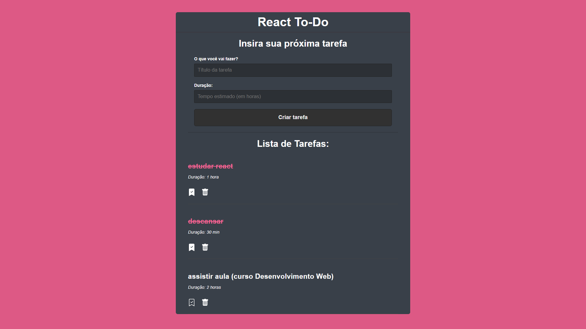

<h1>REACT TO DO LIST</h1>

---

<h2>Sobre o projeto 🔥</h2>

<p>Depois de um tempo estudando Javascript, resolvi desenvolver meu primeiro projeto em React. Este é um app bastante conhecido, o "To Do List", durante o processo de criação, vi coisas como **fetch api**,  **db.json**, **useState**, **useEffect** e mais.<br />
Neste projeto podemos salvar tarefas, adicionando um título e uma duração estimada que levará para realizá-la. Abaixo elas serão exibidas e poderão ser marcadas como já realizadas ou excluídas.</p>

---

<h2>Preview do App 😉</h2>

<p>No print abaixo, podemos visualizar o app com 3 tarefas registradas, duas delas já concluídas.</p>



---

<h2>Instruções 📓</h2>

<p>Para iniciar o projeto, abra o terminal e digite o seguinte comando:</p>

```bash
   npm start
```

<h3>Requisitos ⚠️ </h3>

- Necessário ter **Node** instalado

O projeto será iniciado no endereço **localhost:3000**.

O banco de dados db.json ficará no **localhost:5000**.

---

<h2>Tecnologias utilizadas 🖥️</h2>

- [HTML](https://www.w3.org/html/)
- [CSS](https://www.w3schools.com/css/default.asp)
- [Javascript](https://www.javascript.com)
  - [React](https://pt-br.reactjs.org)

---

<h2>Referências 💭</h2>

- Este projeto foi desenvolvido junto à esta excelente [vídeo aula](https://www.youtube.com/watch?v=pOVyVivyfok) do canal **Matheus Battisti - Hora de Codar**.
